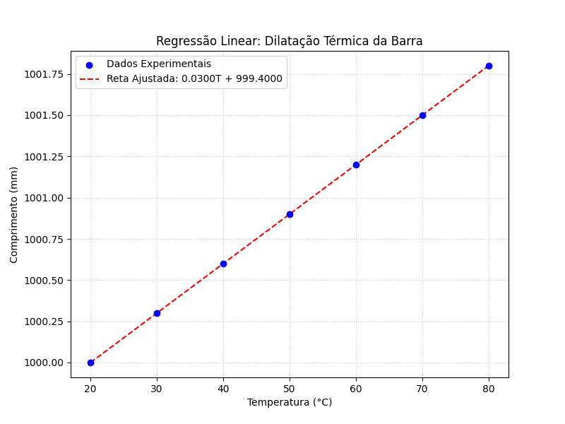

  

# 🌡️ Análise de Dilatação Térmica via Regressão Linear

Este repositório contém uma implementação algorítmica do **Método dos Mínimos Quadrados** para modelar o fenômeno físico da dilatação térmica linear de uma barra metálica.

O objetivo é encontrar a equação da reta $L(T) = aT + b$ que melhor se ajusta aos dados experimentais de Temperatura ($T$) versus Comprimento ($L$).

## 🛠️ Tecnologias Utilizadas

* **Python 3**: Linguagem base.
* **NumPy**: Para manipulação de arrays e cálculos matemáticos vetoriais.
* **Matplotlib**: Para visualização de dados e plotagem do gráfico de regressão.

## 📐 Metodologia

O script não utiliza funções prontas de regressão (como `scikit-learn`), mas sim a implementação "pura" (from scratch) das fórmulas estatísticas para fins didáticos:

1. **Definição do Modelo**: $y = ax + b$ (onde $y$ é o Comprimento e $x$ é a Temperatura).
2. **Cálculo dos Coeficientes**:
    * Inclinação ($a$): Calculada via covariância e variância.
    * Interseção ($b$): Calculada pela média das variáveis.
3. **Avaliação de Erro**:
    * Comparação com um modelo teórico pré-estabelecido.
    * Cálculo do Coeficiente de Determinação ($R^2$) para validar a qualidade do ajuste.

## 📝 Pseudocódigo

    INICIO
        DEFINIR dados_T (Temperatura) e dados_L (Comprimento)
    
        // 1. Calcular Somatórios
        sum_x  = SOMAR(dados_T)
        sum_y  = SOMAR(dados_L)
        sum_xy = SOMAR(dados_T * dados_L)
        sum_x2 = SOMAR(dados_T ^ 2)
        n      = TAMANHO(dados_T)
    
        // 2. Aplicar Mínimos Quadrados
        a = (n * sum_xy - sum_x * sum_y) / (n * sum_x2 - sum_x^2)
        b = (sum_y - a * sum_x) / n
    
        // 3. Validar Modelo
        IMPRIMIR "Equação: L(T) = a*T + b"
        CALCULAR R_quadrado (Qualidade do ajuste)
    
        // 4. Visualização
        GERAR Gráfico de Dispersão (Dados Reais)
        TRAÇAR Reta Ajustada (a*T + b)
        SALVAR imagem "grafico_regressao.png"
    FIM

## 🚀 Como Rodar o Projeto

### Pré-requisitos

Certifique-se de ter o Python instalado e as bibliotecas necessárias. Você pode instalar as dependências com o comando:

    pip install numpy matplotlib

### Execução

Para rodar a análise e gerar o gráfico, execute o arquivo principal no terminal:

    python regressao_linear.py

O script irá exibir os cálculos no terminal e salvar um arquivo `grafico_regressao.png` na pasta raiz.

## 📊 Resultados Obtidos

O algoritmo convergiu com sucesso para os parâmetros esperados, demonstrando um ajuste perfeito aos dados experimentais fornecidos.

### 1. Modelo Matemático Encontrado

O script determinou a seguinte equação para a dilatação da barra:

    L(T) = 0.0300 T + 999.4000

* **Coeficiente Linear (Dilatação):** 0.0300 mm/°C
* **Comprimento Inicial ($T=0$):** 999.4000 mm
* **Coeficiente de Determinação ($R^2$):** 1.000000 (Ajuste Perfeito)

### 2. Visualização Gráfica

Abaixo está o gráfico gerado pelo script, mostrando a sobreposição dos dados experimentais (pontos azuis) com a reta ajustada (linha tracejada vermelha).

## 👤 Autores

### Deivy Rossi

### Lucas Roseno

Desenvolvido para fins de estudo sobre Regressão Linear aplicada à Física Computacional.
